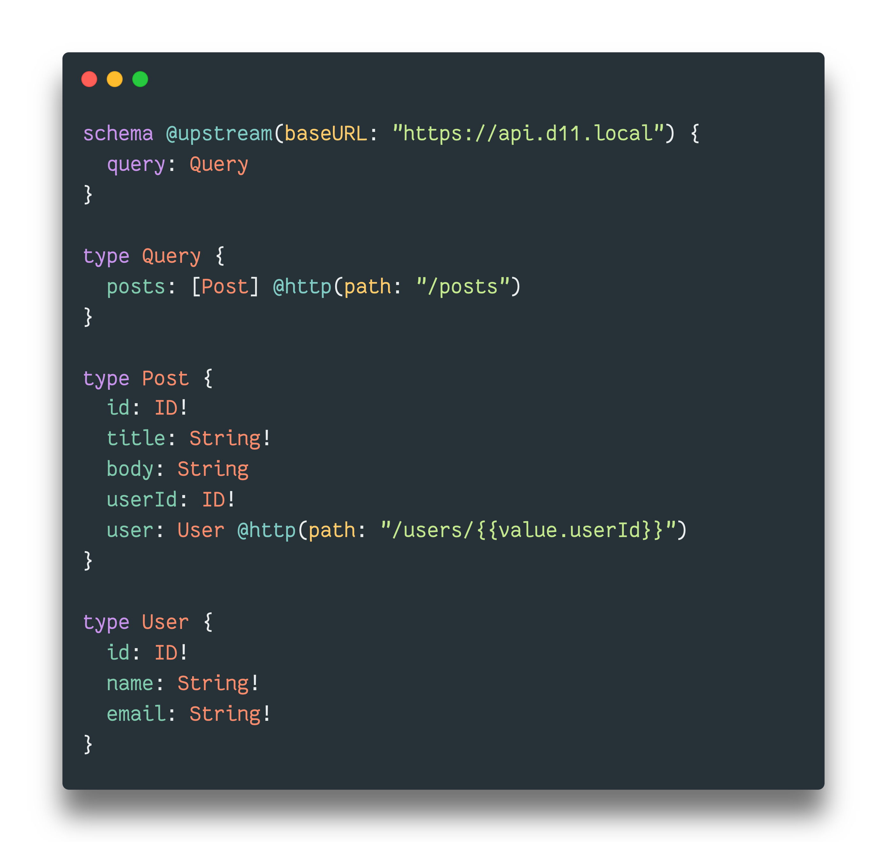
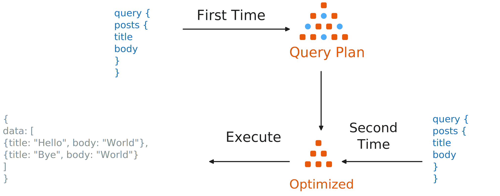

class: center middle

.font-size-5[.tc-highlight[Scaling] GraphQL for 500,000,000 req/min]

GraphQL Conf 2024

---

# Who am I?

TODO: GraphQL Fanboy

- Open Source Contributor
- Functional Programming Enthusiast
- Care about DevEx
- Based out of Bangalore (India)
- 2 Year Old at Home

---

class: middle

# GraphQL Journey

## .font-grey[Section 1]

---

# 2016 Dream11

--

.stat[

.stat-item[100,000 .title[Concurrency]]

.stat-item[1,000,000 .title[Users]]

.stat-item[10 .title[Full-Stack Engineers]]

]

---

.block.center[.font-size-5[💰 .weight-700.custom-underline[Series B]]]

--

- Android

- iOS

- PWA

- Microservices

--

## .block.center[.font-size-5[🧐 .weight-700.custom-underline[GraphQL?]]]

---

## .custom-underline[Architecture]

.block.center[.size-75[]]

--

.block.center[Microservices + Apps]

---

# 2024 Dream11

.stat[

.stat-item[500 .title[Engineers]]

.stat-item[10,000,000 .title[Concurrency]]

.stat-item[200,000,000 .title[Users]]

]

--

## .block.center[.font-size-5[🙌 .weight-700.custom-underline[GraphQL]]]

---

class: middle

# Challenges & Workarounds

## .font-grey[Section 2]

---

.font-size-3[👉 .weight-700.custom-underline[Speculative Performance]]

--

.font-size-3[🚀] .font-grey[System]

.font-size-3[💔] .font-grey[Internal]

.font-size-3[🏭] .font-grey[Benchmarking Infrastructure]

---

.font-size-3[👉 .weight-700.custom-underline[Highly Specialized]]

--

.font-size-3[🛠️] .font-grey[Dedicated Team]

---

.font-size-3[👉 .weight-700.custom-underline[Fragile]]

--

.font-size-3[🌀] .font-grey[Processes]

.font-size-3[🏭] .font-grey[Testing Infrastructure]

---

.font-size-3[👉 .weight-700.custom-underline[Caching]]

--

.font-size-3[⚡] .font-grey[On Services]

---

.font-size-3[👉 .weight-700.custom-underline[Resiliency]]

--

.font-size-3[🛡️] .font-grey[API Gateway]

---

.font-size-3[👉 .weight-700.custom-underline[Maintenance]]

--

.block[.center[.font-size-5[🤷]]]

---

class: middle

# Learnings of 8 Years

## .font-grey[Section 3]

---

class:middle center

.font-size-3.weight-700[🕊️ Liberties Constraint and Constraints Liberate🕊️]

---

# GraphQL

--

### 🔒 .custom-underline[Schema]

### 🔒 .custom-underline[Query]

### 🕊️ .custom-underline[Resolver]

---

class: middle center


---

class: middle

.font-size-3[🙅‍♂️ .weight-700.custom-underline[Handwritten GraphQL]]

---

class: middle

.font-size-3[🤔 .weight-700.custom-underline[Learn from SQL]]

---

class: middle

.font-size-3[✋ .weight-700.custom-underline[Avoid Business Logic]]

---

class:middle

# .custom-underline[Default Runtime for GraphQL]

## .font-grey[Section 4]

---

class: middle center flex-col

.logo[]

---

class: middle flex-row

.col-40[
.custom-underline[GraphQL Schema 👉]
]
.col-60[

```graphql
schema {
  query: Query
}

type Query {
  posts: [Post]
}

type Post {
  id: ID!
  title: String!
  body: String
  userId: ID!
  user: User
}

type User {
  id: ID!
  name: String!
  email: String!
}
```

]

---

class: middle flex-row

.col-40[
.custom-underline[Annotations 👉]
]
.col-60[

```graphql
schema @upstream(baseURL: "https://api.d11.local") {
  query: Query
}

type Query {
  posts: [Post] @http(path: "/posts")
}

type Post {
  id: ID!
  title: String!
  body: String
  userId: ID!
  user: User @http(path: "/users/{{value.userId}}")
}

type User {
  id: ID!
  name: String!
  email: String!
}
```

]

---

# Start the server


---

class: middle flex-row

.col-50[

## Comparison

.size-75[]

]
.col-50[
.size-75[]
]

---

class: middle

# How it works

---

# Initialization

<!-- TODO: add an excalidraw visual  -->

- Read the configuration

- Attach Resolvers

- Initialize HTTP Server

---

# Query Execution



---

# Upstream

- REST

- gRPC

- GraphQL

--

.block.center[.font-size-4[🎨 .weight-700.custom-underline[Router]]]

---

## .custom-underline[Revisiting the Challenges]

--

1. Predictable Performance

--

2. Generalized GraphQL Runtime

--

3. Robust Foundations

--

4. Resilient to Errors

--

5. Configuration Driven

---

## .custom-underline[Awesome Community 🙌]


.logo[]

---


https://github.com/tailcallhq/tailcall

- RUST > Performance
- Try it Out | Feedback
- Github
- Binary Size
- Contributors
- Releases
- Commits

<!-- Github Repo -->
<!-- Contributors + Releases + Commits -->
<!-- Looking for Contributors and Feedback! -->

---

class: middle

# Takeaway

## .font-grey[Section 5]

---

## .custom-underline[Takeaway]

1. Innovation on GraphQL performance is necessary.

2. Handwritten GraphQL is difficult to maintain.

3. Library authors should take inspiration from SQL engines.

---

## .custom-underline[Official Introduction]

1. Founder of Tailcall

--

2. VP of Engineering at Dream11

--

3. Open Source Author and Maintainer

--
.center[
.icon[]
@tusharmath

.icon[]
@tusharmath

.icon[]
@tusharmath
]

---

class: flex-row

.col-60[

# .custom-underline[\#TailcallHack]

- Build the GraphQL Server

- 2,000 USD Prize

- Checkout - tailcallhq/hackathon

]

.col-40[
.middle.size-50[]
]

---

class: flex-col center

# Thank You!

.font-size-5[❤️]

---

class:middle custom-background-image
background-image: url(./img/rush-hour.png)

--

.font-size-3.weight-500[🚦 Traffic Signal]

.font-size-3.weight-500[👮 Fine]

.font-size-3.weight-500[🛣 Marking]

---

class: middle
.block.half[]
.two-columns[
.column[
.font-size-3[
.custom-underline[
🚧 .weight-500[Constraint]
]
]

- # Schema

- # Query

- # Single Endpoint

- DSL
  ]
  .column[
  .font-size-3[
  .custom-underline[
  🕊️ .weight-500[Liberties]
  ]
  ]

- Type System

- Efficiency

- Unification

- Specialization
  ]
  ]

---

class: two-columns

.column[
.font-size-3[
.custom-underline[
🕊️ .weight-500[Liberties]
]
]

- Type System

- Efficiency

- Unification

- Specialization

]

.column[
.font-size-3[
.custom-underline[
🚧 .weight-500[Constraint]
]
]

- Learning Curve

- Complexity

- Reliability 🙅

- Interoperability 🙅

]

# 2020 .tc-highlight[Rewrite] GraphQL

1. High performance & reliability

2. Declarative, extendable & modular Design

3. Connect to any data-source

---

# 2021 .tc-highlight[Launch]

--

- Before `40,000` cores

--

- After `6,400` cores

--

.stat[

.stat-item[🚀 7x .title[Performance]]

.stat-item[💵 85% .title[Cost]]

.stat-item[💪 3 .title[Team]]

]

---

# 2022 .tc-highlight[Open Source]

Before open sourcing:

--

- ~~JS~~ to Rust

--

- ~~Declarative~~ to Configuration

---

# Agenda

1. GraphQL Journey

2. Challenges & Workarounds

3. Learnings

4. Ideal Solution

5. Key Takeaway
